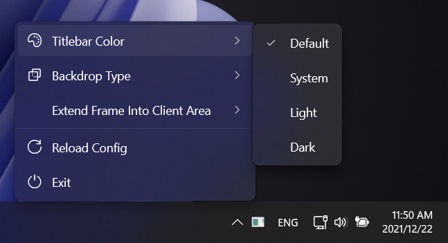
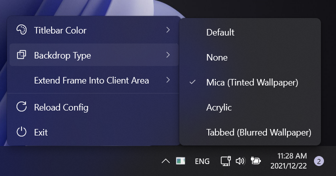
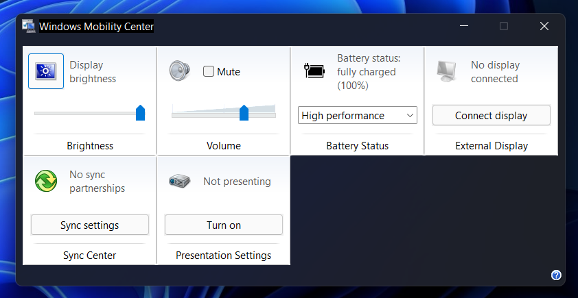

> # Be Iranian's voice!
> 
> Right now as you read this, the government is killing hundreds of protestors in Iran.
> People are seeking freedom while they have highly restricted access to Internet and only state-owned media is allowed to operate.
> 
> * In July 1999 they attacked students nightly in dorm because they protested for freedom of newspapers.
> * In December 2019 - January 2020 people were protesting for increase of prices and then the government killed more than 1500 of them. We experienced full Internet shutdown during that time.
> * In September 2022 the <!--morality--> police killed an innocent girl and created <!--rise--> a wave of unhappy people, and since then people are fighting. In these days we hear a lot about the arrest of innocent people and protestors, and even <!--the--> people who did nothing.
> 
> Jadi Mirmirani, an Iranian open-source activist and Mohsen Tahmasbi, an Iranian security researcher are among the arrested people in October 2022.

  

<h1 align="center">Mica For Everyone!</h1>

  
  

**Mica For Everyone** is a tool to customize system backdrop on Win32 apps using [DwmSetWindowAttribute](https://docs.microsoft.com/en-us/windows/win32/api/dwmapi/nf-dwmapi-dwmsetwindowattribute) and other methods.
It can apply Mica (or any other backdrop materials) on the non-client area (window frame) or background of supported apps and its behavior is customizable through a GUI and a config file.

> **Note**
> Mica For Everyone is not responsible for rendering the effects you set, it just asks Windows to do that for you. If there's any problem with the effects it's a third-party issue. Try creating a rule for the affected apps and try different settings before opening an issue for it.

## 🕹 How do I get it?
Go to **[Releases page](https://github.com/MicaForEveryone/MicaForEveryone/releases) > Assets > and choose the appropriate download** or [just click here to download the latest version of Mica For Everyone](https://github.com/MicaForEveryone/MicaForEveryone/releases/latest).

## 🛠 Config File
For more information check our [wiki page](https://github.com/MicaForEveryone/MicaForEveryone/wiki/Config-File) and [default config file](MicaForEveryone/Resources/MicaForEveryone.conf).

## 🖥 Screenshots

## 🌍 Localization
Translations into versions for other languages are welcome! Please read the [translation guide](./CONTRIBUTING.md#translating) before starting translations.

| Key     | Name                  | Translator                                                                                         |
|---------|:----------------------|:---------------------------------------------------------------------------------------------------|
| az-Latn | Azerbaijian (Latin)   | [thepoladov13](https://github.com/thepoladov13)
| de      | German                | [uDEV2019](https://github.com/uDEV2019)                                                            |
| es      | Spanish               | [Amaro Martínez](https://github.com/xoascf)                                                        |
| fr      | French                | [SaiyajinK](https://github.com/SaiyajinK)                                                          |
| hu      | Hungarian             | [Zan1456](https://github.com/Zan1456)                                                              |
| id      | Indonesian            | [seanardhana](https://github.com/seanardhana), [GID0317](https://github.com/GID0317)               |
| it      | Italian               | [alessandrocaseti](https://github.com/alessandrocaseti), [A-Loot](https://github.com/A-Loot)       |
| ja      | Japanese              | [maboroshin](https://github.com/maboroshin)                                                        |        
| ko      | Korean                | [RTFTR](https://github.com/RTFTR)                                                                  |
| nl      | Dutch                 | [toineenzo](https://github.com/toineenzo)                                                          |
| pl      | Polish                | [Piteriuz](https://github.com/Piteriuz)                                                            |
| pt-br   | Brazilian Portuguese  | [Douglas Vianna](https://github.com/dgsmiley18)                                                    |
| ru      | Russian               | [Danik2343](https://github.com/Danik2343), [krlvm](https://github.com/krlvm)                       |
| sr      | Serbian               | [bzzrak](https://github.com/bzzrak)                                                                |
| tr      | Turkish               | [Meriç Bağlayan](https://github.com/baglayan)                                                      |
| uk-ua   | Ukrainian             | [Phyan](https://github.com/Phyan), [lowl1f3](https://github.com/lowl1f3)                           |
| vi      | Vietnamese            | [chefkozaki](https://github.com/chefkozaki)                                                        |
| zh-Hans | Chinese (Simplified)  | [AndromedaMelody](https://github.com/AndromedaMelody), [FrzMtrsprt](https://github.com/FrzMtrsprt) |
| zh-Hant | Chinese (Traditional) | [MW1Z](https://github.com/MW1Z), [jay900604](https://github.com/jay900604)                         |
 
## 🖊️ Contributing
If you're interested in contributing or translating Mica For Everyone, check our [CONTRIBUTING.md](CONTRIBUTING.md) file.

## ☑️ Frequency Asked Questions
Check [wiki page](https://github.com/MicaForEveryone/MicaForEveryone/wiki/FAQ) or [issues](https://github.com/MicaForEveryone/MicaForEveryone/issues).
