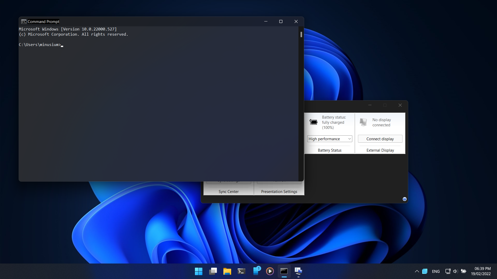

# Mica for Everyone!
**NOTE:** This app requires at least Windows 11 build 22000+, but some options are only available on 22523+.

Using this tool you can enable Backdrop effect on non-client area (Titlebar and borders) of all win32 apps.

It uses [DwmSetWindowAttribute](https://docs.microsoft.com/en-us/windows/win32/api/dwmapi/nf-dwmapi-dwmsetwindowattribute)
on all open windows to enable backdrop and dark titlebar.

You can customize app behavior using a config file or its tray icon context menu.

# Config File
Mica For Everyone can be configured using a rule-based configuration language.

```
# applies to all windows
Global {
  TitleBarColor           = System  # available modes: default, system, light, dark
  BackdropPreference      = Mica    # available modes: default, none, mica, acrylic, tabbed
  ExtendFrameToClientArea = false   # enable to apply backdrop on background of apps (not recommended)
}

# only applies to windows from explorer process
# note that process name must be without .exe extension.
Process: explorer {
  ...
}

# only applies to windows with ApplicationFrameWindow as class name
Class: ApplicationFrameWindow {
  ...
}
```

# Extend Frame Into Client Area
This option extends window frame to whole app background so you'll see Mica on app's background,
but most of the apps draw their own background on top of window background so basically this won't work.
This option is there for testing and it's not intended for daily usage, using it is not recommended.

# Screenshots



