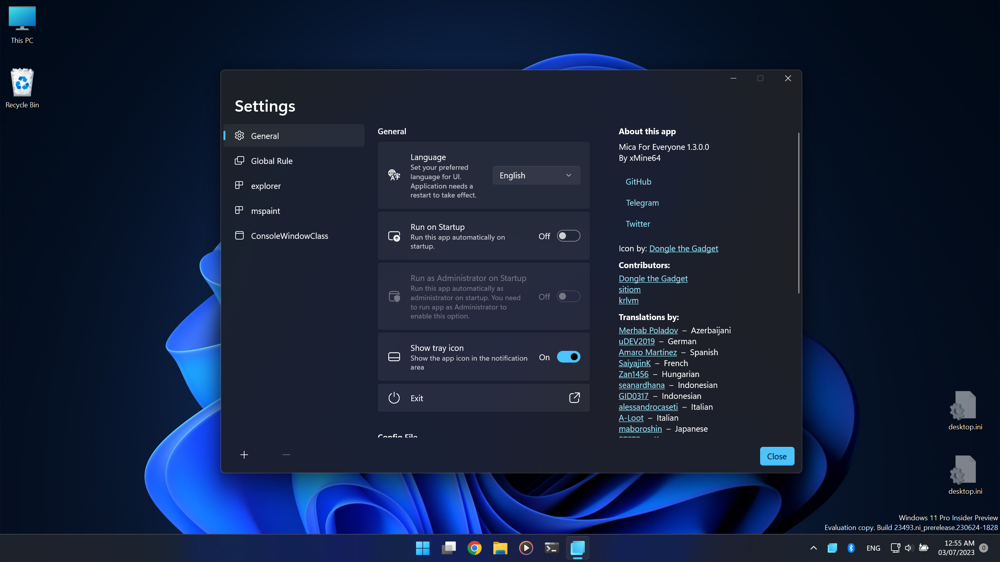

# Be Iranian's voice!
Right now as you read this, the government is killing hundreds of protestors in Iran.
People are seeking freedom while they have highly restricted access to Internet and only gevornment-based media are allowed to operate.

* In July 1999 they attacked students nightly in dorm because they protested for freedom of newspapers.
* In December 2019 - January 2020 people were protesting for increase of prices and then the government killed more than 1500 of them. We experienced full Internet shutdown during that time.
* In September 2022 the <!--morality--> police killed an innocent girl and caused <!--rise--> a wave of unhappy people, and since then people are fighting. In these days we hear a lot about the arrest of innocent people and protestors, and even <!--the--> people who did nothing.

Jadi Mirmirani, an Iranian open-source activist and Mohsen Tahmasbi, an Iranian security researcher are among the arrested people in October 2022.

# Mica For Everyone!
Mica For Everyone is a tool to customize system backdrop on win32 apps using [DwmSetWindowAttribute](https://docs.microsoft.com/en-us/windows/win32/api/dwmapi/nf-dwmapi-dwmsetwindowattribute) and other methods.
It can apply Mica (or any other backdrop material) on non-client area (window frame) or background of supported apps and its behavior is customizable through a GUI and a config file.

## Config File
For more information check our [wiki page](https://github.com/minusium/MicaForEveryone/wiki/Config-File) and [default config file](MicaForEveryone/Resources/MicaForEveryone.conf).

## Screenshots

## Frequency Asked Questions
Check [wiki page](https://github.com/minusium/MicaForEveryone/wiki/FAQ) or [issues](https://github.com/minusium/MicaForEveryone/issues).
