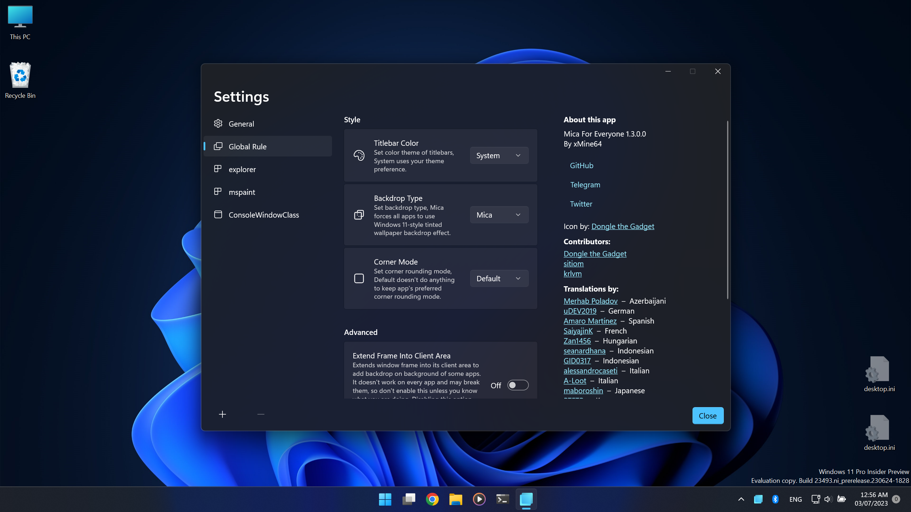

# Mica for Everyone!
**NOTE:** This app requires at least Windows 11 build 22000+, but some options are only available on 22523+.

Using this tool you can enable Backdrop effect on non-client area (Titlebar and borders) of all win32 apps.

It uses [DwmSetWindowAttribute](https://docs.microsoft.com/en-us/windows/win32/api/dwmapi/nf-dwmapi-dwmsetwindowattribute)
on all open windows to enable backdrop and dark titlebar.

You can customize app behavior using a config file or its tray icon context menu.

# Config File
```ini
; Availabe: Default, None, Mica, Acrylic, Tabbed
BackdropPreference        = Mica

; Available: Default, Light, Dark
TitleBarColor             = Default

; Set to True to get backdrop on apps background (not recommended)
ExtendFrameIntoClientArea = False

; Applies to specific apps, by Process or ClassName

; Applies to specific process
; Name: Process name without ".exe" extension
[Process]
Name                      = explorer
BackdropPreference        = Default
TitleBarColor             = Default
ExtendFrameIntoClientArea = False

; Applies to specific window class
[ClassName]
Name                      = ApplicationFrameWindow
BackdropPreference        = Default
TitleBarColor             = Default
ExtendFrameIntoClientArea = False
```

# Screenshots





